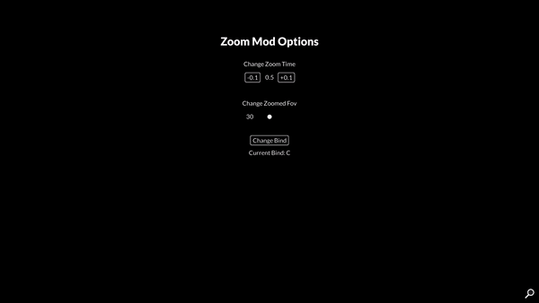

# Zoom Mod For Teardown
### Features

- Customizable Zoomed FOV
- Customizable Zoom Speed

### Zooming in

Press **C** to zoom in

### Redesigned Options

- The **Keybind Button** lets you set a custom bind for the zoom
- The **Zoomed FOV** is the one that's used when zooming in 
- The **Zoom Speed** is the amount of time it takes to zoom in 
- The **Reset Settings Button** only appears when settings are changed, it resets them to default
- The **Toggle Zoom Button** changes the zoom type from holding the button to toggle the zoom (I didn't update the gif)

