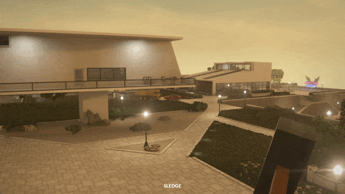

# Zoom Mod For Teardown
### Features

- Customizable FOV **(up to 170)**
- Customizable Zoomed FOV **(can go as low as 0)**
- Customizable Zoom Speed

### Zooming in

Press **C** to zoom in

### Options

- The **Keybind Button** lets you set a key for the zoom
- The **Default FOV** is the fov that's used when you are not zooming in
- The **Zoomed FOV** is the one that's used when zooming in 
- The **Zoom Speed** is the amount of time it takes to zoom in 
- The **Save Button** saves your settings
- The **Default Button** resets your settings to default

